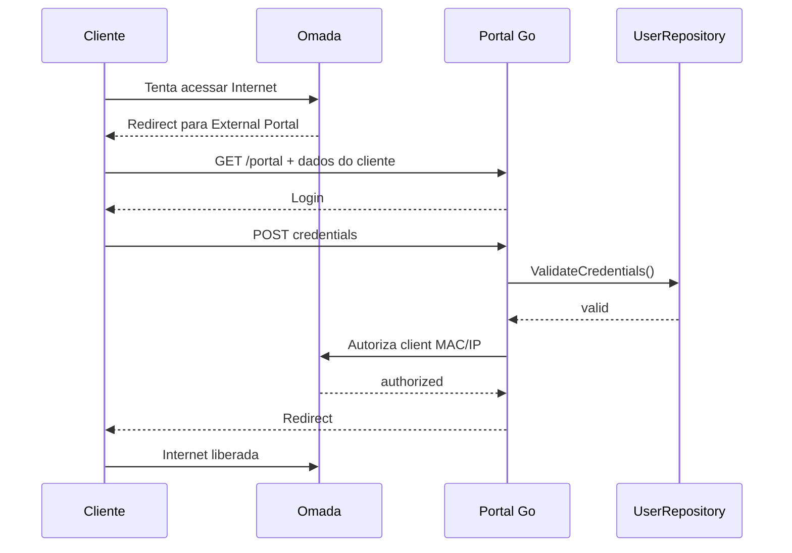

# Arquitetura do network-auth-service

## Visão geral

Este serviço implementa o fluxo de autenticação de clientes em captive portal usando o modelo do Omada Controller em Controller Mode com External Portal Server.

A responsabilidade principal do microsserviço é:

- receber o redirecionamento do captive portal do Omada;
- apresentar um formulário de login em HTML responsivo;
- validar credenciais localmente ou por repositório externo futuro;
- autorizar apenas o cliente cujo MAC/IP foi capturado no fluxo do portal;
- redirecionar o cliente de volta para a URL original quando for segura.

O serviço não implementa portaria, moradores, visitantes, controle físico, câmeras, financeiro ou qualquer outra regra do condomínio.

## Princípios arquiteturais

- Clean Architecture / Hexagonal Architecture
- dependência em direção às interfaces e não aos detalhes de infraestrutura;
- adapters isolados para persistência local e integração Omada;
- uso da standard library do Go sempre que razoável;
- nenhum endpoint Omada inventado; qualquer ajuste de contrato específico fica encapsulado em um adapter;
- configurações sensíveis e detalhes de ambiente via variáveis de ambiente.

## Estrutura de diretórios

```text
network-auth-service/
├── cmd/
│   ├── api/
│   │   └── main.go
│   └── hashpassword/
│       └── main.go
├── internal/
│   ├── domain/
│   │   ├── client.go
│   │   ├── portal_session.go
│   │   └── user.go
│   ├── application/
│   │   └── auth/
│   │       ├── request.go
│   │       ├── response.go
│   │       └── service.go
│   ├── ports/
│   │   ├── network_authorizer.go
│   │   └── user_repository.go
│   ├── adapters/
│   │   ├── omada/
│   │   │   ├── client.go
│   │   │   ├── dto.go
│   │   │   ├── errors.go
│   │   │   └── auth.go
│   │   └── repository/
│   │       └── local/
│   │           └── user_repository.go
│   ├── transport/
│   │   └── http/
│   │       ├── handler.go
│   │       ├── middleware.go
│   │       ├── router.go
│   │       └── templates.go
│   ├── config/
│   │   └── config.go
│   └── security/
│       └── portal_session_store.go
├── web/
│   └── templates/
│       ├── login.html
│       └── error.html
├── .env.example
├── .gitignore
├── Dockerfile
├── docker-compose.yml
├── go.mod
├── Makefile
├── IMPLEMENTATION_PLAN.md
├── README.md
└── users.json
```

## Camadas

### 1. Domain

Responsável pela modelagem do domínio:

- `User`
- `Client`
- `PortalSession`

Não há dependência de HTTP, banco, JSON ou Omada aqui.

### 2. Application

Responsável pela regra de autenticação:

- validar sessão de portal;
- validar credenciais usando um `UserRepository`;
- autorizar cliente usando um `NetworkAuthorizer`;
- impedir reutilização de sessão e expiração;
- impedir autenticação para MAC/IP divergentes do fluxo original.

### 3. Ports

Abstraem a infraestrutura:

- `UserRepository`
- `NetworkAuthorizer`

A camada de aplicação depende apenas destas interfaces.

### 4. Adapters

Implementam detalhes externos:

- `local.UserRepository` para desenvolvimento;
- `omada.Client` para integração com Omada Controller.

Qualquer diferença por versão do Omada Controller fica isolada neste adapter.

### 5. Transport HTTP

Responsável por:

- receber redirecionamentos do Omada;
- criar sessão segura do portal;
- renderizar HTML do login;
- tratar POST de autenticação;
- aplicar headers HTTP de segurança;
- expor `/health` e `/ready`.

## Fluxo de autenticação



## Segurança do portal

A implementação usa:

- sessão temporária em memória com TTL de 5 minutos por padrão;
- identificador aleatório criptograficamente seguro;
- MAC/IP armazenados no servidor e não aceitos no formulário;
- redirecionamento seguro para URL original apenas quando válida e segura;
- rate limiting por IP e por username;
- proteção contra session fixation, replay e brute force;
- headers HTTP de segurança;
- registro estruturado sem senhas ou tokens sensíveis.

## Omada / External Portal Server

A integração com Omada deve seguir a documentação oficial do fabricante e manter a adaptação de diferenças por versão encapsulada em `internal/adapters/omada`.

Os pontos a atender:

- Controller Mode
- External Portal Server
- cliente redirecionado para um portal externo;
- autorização do cliente apenas após autenticação válida;
- uso de `site`, `controllerId` e `csrf` quando a versão do Controller exigir;
- TLS obrigatório em produção, com `OMADA_TLS_INSECURE=false` por padrão;
- certificados self-signed somente quando explicitamente habilitados.

## Fontes oficiais consultadas

A integração respeita a documentação pública atual da TP-Link / Omada Support. O código documenta no adapter e no README quais pontos são dependentes de versionamento e quais campos/flows são relevantes para Omada Controller 5.0.15+.

No código, qualquer diferença relevante de contrato entre versões do Omada Controller deve ser isolada em `internal/adapters/omada` e documentada no README e nos comentários do adapter.

## Limitações conhecidas

- o Omada Controller real pode exigir contratos específicos por versão, por site e por configuração do Controller;
- o `external portal` usa dados do gateway/controller e redirecionamento do cliente;
- a autorização do cliente deve ser validada contra a própria API do Controller do ambiente de deploy;
- a autenticação local é apenas um back-end de desenvolvimento; a arquitetura permite trocar para API do sistema principal sem mudar o serviço de autenticação.
