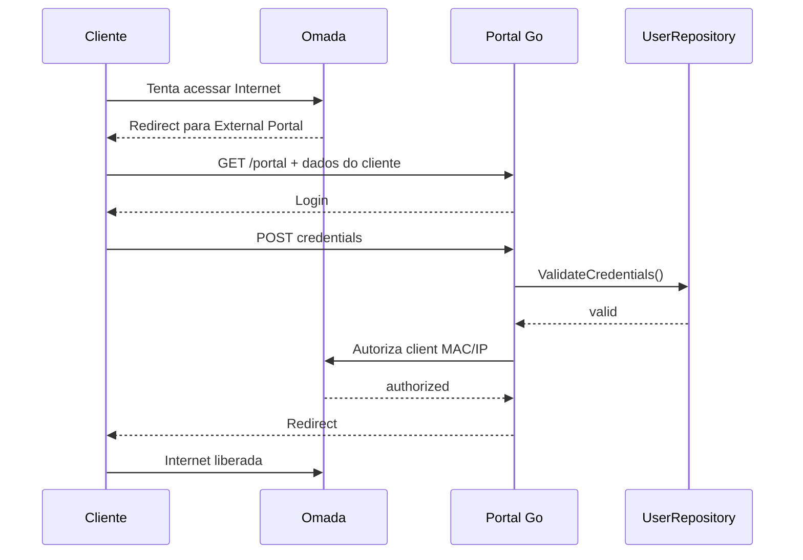

# network-auth-service

Microsserviço em Go para autenticação de clientes em captive portal do Omada Controller, seguindo Clean Architecture / Hexagonal Architecture.

## Arquitetura

A arquitetura foi organizada em camadas:

- domain: modelos e regras do domínio
- application: serviço de autenticação
- ports: interfaces de dependência
- adapters: repositório local e integração Omada
- transport/http: endpoints do portal e segurança HTTP
- config: configuração por environment variables

O desenho detalhado está em [ARCHITECTURE.md](ARCHITECTURE.md).

## Fluxo External Portal Server

1. o cliente tenta acessar a internet;
2. o gateway/Omada redireciona para o portal externo;
3. o serviço recebe `GET /portal` com dados do cliente;
4. o sistema cria uma sessão temporária e renderiza o HTML do login;
5. o cliente envia `POST /portal/authenticate` com `session_id`, `username`, `password`;
6. o serviço valida a conta localmente;
7. o adapter Omada envia a autorização do cliente;
8. o navegador é redirecionado para a URL segura original.

## Como executar localmente

```bash
go mod tidy
go run ./cmd/api
```

## Gestao de acesso dos apartamentos

O servico expoe `GET/POST/PUT/DELETE /admin/internet-accounts` e
`POST /admin/internet-accounts/{id}/password`. As chamadas exigem
`Authorization: Bearer $ADMIN_API_TOKEN`. O backend da portaria deve guardar o
token no servidor e encaminhar seu contrato `/api/internet-accounts` para essas
rotas; o token nunca deve ser enviado ao navegador.

Novas contas recebem validade de 90 dias, tres dispositivos, download/upload de
30.000 Kbps e senha alfanumerica de seis caracteres exibida uma unica vez. Apenas
o hash bcrypt e persistido. Um MAC autenticado e lembrado ate a expiracao da conta
e pode ser reautorizado automaticamente.

Contas de funcionarios sao criadas em `/admin/internet-accounts/employees`,
exigem `EMPLOYEE_ENROLLMENT_PASSWORD`, aceitam uma senha individual livre e
recebem validade de 30 dias, uma conexao e 10.000 Kbps de download/upload. A
senha de liberacao e a senha individual nunca sao persistidas em texto puro.

Configure no Omada um perfil de Portal/SSID com 30.000 Kbps de download e upload.
O payload do External Portal nao recebe rate limit. Para troca de senha, bloqueio
ou remocao com dispositivos ativos, configure `OMADA_REVOCATION_PATH` com a rota
de desconexao confirmada para a versao instalada do Controller. Sem essa rota, a
operacao falha antes de alterar o cadastro.

A aplicação usa as variáveis de ambiente do arquivo `.env`, conforme descrito em [.env.example](.env.example).

## Environment variables

```env
APP_PORT=8080
APP_ENV=development
LOG_LEVEL=INFO

OMADA_BASE_URL=https://192.168.10.100:8043
OMADA_USERNAME=portal-service
OMADA_PASSWORD=
OMADA_SITE=Chateauneuf
OMADA_CONTROLLER_ID=0217b8a5a6dff81d96783c9ddc9e3f46
OMADA_TLS_INSECURE=true
OMADA_AUTHORIZATION_PATH=
OMADA_AUTHORIZATION_METHOD=POST

USERS_FILE=./users.json
PORTAL_SESSION_TTL=5m
CLIENT_AUTH_DURATION=24h

RATE_LIMIT_REQUESTS=20
RATE_LIMIT_WINDOW=1m
```

## Como gerar password hash

```bash
go run ./cmd/hashpassword 'minhaSenha123'
```

## Como cadastrar usuário de desenvolvimento

O arquivo base já inclui o usuário de exemplo abaixo:

```json
[
  {
    "username": "apto72",
    "password_hash": "$2a$10$JZ9PwyKEL6E5NxYf0H08E.gD5kI2w.au38iHxpBDGQPr7eKJ5vS4m",
    "enabled": true
  }
]
```

Para criar outra senha, use:

```bash
go run ./cmd/hashpassword 'senhaSegura123'
```

E depois substitua o valor do campo `password_hash` no arquivo `users.json`.

## Como executar testes

```bash
go test ./...
go vet ./...
```

## Como gerar imagem Docker

```bash
docker build -t network-auth-service .
```

## Configuração do External Portal Server no Omada

No Controller Mode, configure:

- Authentication Type: External Portal Server
- Portal Server URL: a URL pública ou acessível pelo cliente e pelo Controller
- redirect URL e parâmetros do cliente conforme o requisito do Omada
- `clientMac`, `clientIp`, `site`, `redirectUrl` e demais parâmetros dependentes da versão do Controller

Os detalhes específicos do contrato real ficam encapsulados no adapter Omada em `internal/adapters/omada`.

Para Omada Controller 5.0.15 a 6.2, crie uma conta em `Hotspot > Operators`; não use a conta administrativa do Controller. O adapter autentica em `/{controllerId}/api/v2/hotspot/login`, preserva o cookie `TPOMADA_SESSIONID` e o token CSRF, e autoriza o cliente em `/{controllerId}/api/v2/hotspot/extPortal/auth`, conforme o contrato oficial da TP-Link.

`OMADA_TLS_INSECURE=true` deve ser usado somente enquanto o Controller utilizar certificado autoassinado. Em produção, instale um certificado confiável e altere o valor para `false`.

## Como descobrir a URL que deve ser configurada no Controller

A URL do serviço depende do endereço em que ele será exposto. Em ambiente local, pode ser algo como:

```text
http://localhost:8080/portal
```

Se o Omada estiver atrás de um proxy ou NAT, configure a URL externa acessível pelos clientes e pelo Controller, e mantenha a mesma rota `/portal` no serviço.

Exemplo prático de uso local:

- serviço em execução em `http://localhost:8080`
- rota do portal: `http://localhost:8080/portal`
- usuário de exemplo: `apto72`
- senha de exemplo: `senha123`

> A senha do exemplo foi gerada com bcrypt e já está no arquivo `users.json`.

## Limitações conhecidas

- este serviço não implementa regras de morador, portaria, câmeras ou financeiro;
- o adapter implementa o contrato de External Portal documentado para Omada Controller 5.0.15 a 6.2; outras versões devem ser validadas separadamente;
- a autenticação local é apenas um backend de desenvolvimento, preparado para ser trocado por uma API do sistema principal.

## Diferenças relevantes por versão do Omada

A integração foi isolada em `internal/adapters/omada` para separar:

- autenticação do serviço no Controller;
- gerenciamento de sessão e CSRF;
- payload de autorização do cliente;
- diferenças de endpoint ou header por versão;
- tratamento de TLS self-signed em laboratório.

A regra de ouro é: não inventar endpoints ou campos. Todo ajuste do contrato oficial fica no adapter e deve ser documentado nele e neste README.

## Mermaid sequence diagram


